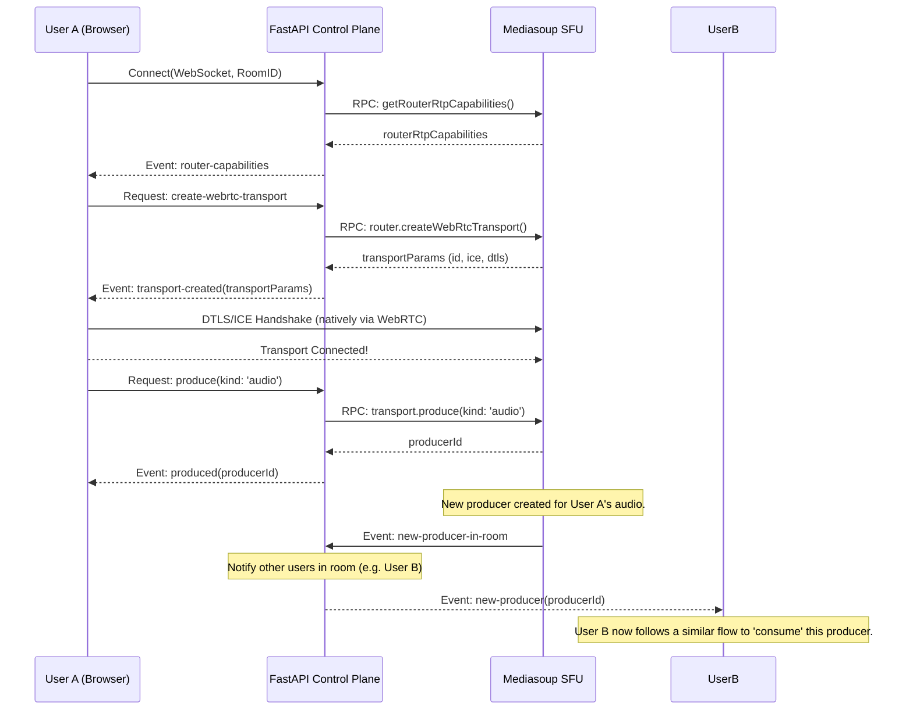
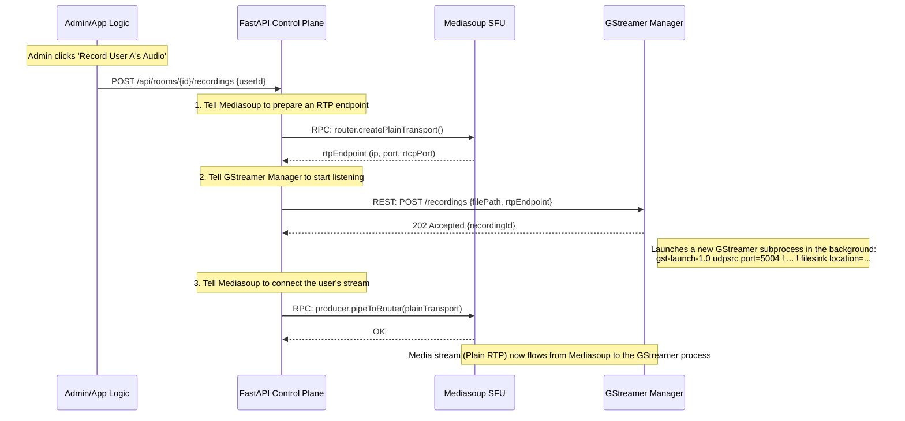

Integrating **GStreamer** alongside **Mediasoup** is a powerful and common pattern for building advanced media capabilities. This architecture correctly assigns roles: Mediasoup is the real-time SFU, and GStreamer is the media processing workhorse.

Let's architect this system from the ground up, using Mermaid diagrams to clearly illustrate the component interactions.

### Core Component Roles

1.  **FastAPI (Control Plane):** The "brain" and orchestrator of the entire system. It manages users, rooms, and permissions. It does **not** process media but tells the other components what to do with the media.
2.  **Mediasoup (Data Plane - Real-Time):** The high-performance Selective Forwarding Unit (SFU). Its only job is to receive WebRTC media streams from clients and efficiently route them to other clients in real-time.
3.  **GStreamer (Data Plane - Processing):** The "specialized tool." It's a pipeline-based multimedia framework. We will use it for tasks that are not real-time forwarding, such as recording, transcoding, or injecting media. It acts as a bot or a service that consumes or produces streams from/to Mediasoup.
4.  **GStreamer Manager (Control Plane - Sidecar):** A small helper service you will write. Since GStreamer is a command-line tool, this service provides a simple API (e.g., REST) for FastAPI to control it (e.g., "start recording this stream").

---

### High-Level System Architecture

This diagram shows the main components and how they are logically grouped into planes. The key takeaway is the addition of a **Media Processing Plane** which is distinct from the real-time Data Plane.

```mermaid
graph TD
    subgraph User Layer
        UserClient[User's Browser]
    end

    subgraph Control Plane
        A[FastAPI Server]
        GM[GStreamer Manager API]
    end

    subgraph Data Plane (Real-Time)
        B[Mediasoup Node.js Server]
    end

    subgraph Media Processing Plane
        C[GStreamer Worker Process]
    end

    subgraph Shared State
        R[Redis Pub/Sub]
    end

    UserClient -- "1. Signaling (WSS)" --> A
    A -- "2. Orchestration (RPC over WS)" --> B
    A -- "5. Control (REST/RPC)" --> GM
    A -- "State Sync" --- R

    B -- "3. Media (WebRTC/SRTP)" <==> UserClient
    B -- "4. Media (Plain RTP)" --> C

    GM -- "6. Manages Lifecycle" --> C

    style B fill:#d4fcd7,stroke:#333,stroke-width:2px
    style C fill:#fcf3d4,stroke:#333,stroke-width:2px
    style A fill:#d4e4fc,stroke:#333,stroke-width:2px
```

**Flow Description:**

1.  **Signaling:** The user connects to the **FastAPI** server via a WebSocket for signaling and room control.
2.  **Orchestration:** **FastAPI** orchestrates the **Mediasoup** server, telling it to prepare for the user's media.
3.  **Real-Time Media:** The user's browser establishes a direct WebRTC connection to **Mediasoup** to send and receive media from other participants.
4.  **Internal Media Handoff:** When a special task is required (like recording), **Mediasoup** is instructed to send a specific media stream out as a plain RTP stream.
5.  **Process Control:** **FastAPI** tells the **GStreamer Manager** to start a task (e.g., "start recording"), providing it the IP and port where Mediasoup will send the RTP stream.
6.  **Process Lifecycle:** The **GStreamer Manager** launches and manages the actual **GStreamer Worker** process.

---

### Sequence Diagram 1: A Standard Real-Time Session

This shows the core SFU loop where one user joins and starts sending audio, which is then sent to another user. GStreamer is not involved here.



---

### Sequence Diagram 2: Starting a Server-Side Recording

This is the key diagram showing how all three main components collaborate to achieve a task that Mediasoup cannot do alone.



### In-Depth Explanation of the Recording Flow

1.  **Initiation (Control Plane):** An event triggers the recording. This could be an API call from an admin dashboard or automated business logic within your FastAPI application (e.g., "all meetings in this category must be recorded").

2.  **Prepare the Media Egress (Data Plane - Real-Time):**
    *   FastAPI knows which user's audio (`producerId`) needs to be recorded. It also knows which Mediasoup router is handling the room.
    *   It sends an RPC call to Mediasoup: `router.createPlainTransport()`.
    *   Mediasoup creates a "Plain" WebRTC transport. Unlike a normal transport that speaks the complex SRTP/DTLS/ICE protocol, this one speaks simple, unencrypted **RTP**. It opens a UDP port on the Mediasoup server and returns the IP address and port number to FastAPI. This is the **media exit point**.

3.  **Prepare the Media Ingress (Media Processing Plane):**
    *   FastAPI now has the RTP endpoint details from Mediasoup.
    *   It makes a REST API call to the **GStreamer Manager** service: `POST /recordings`. The request body contains the `ip` and `port` from the previous step, along with metadata like the desired output filename.
    *   The **GStreamer Manager** receives this request. Its job is to translate this API call into a GStreamer pipeline command. It constructs a command line string like:
        ```bash
        gst-launch-1.0 udpsrc port=5004 ! application/x-rtp,media=audio,clock-rate=48000,encoding-name=OPUS ! rtpopusdepay ! opusdec ! autoaudiosink
        ```
        (In a real scenario, it would sink to a file: `... ! oggmux ! filesink location=/recordings/meeting-123.ogg`)
    *   The manager executes this command as a new child process and returns a `recordingId` to FastAPI so the recording can be managed later (e.g., stopped).

4.  **Connect the Pipes:**
    *   FastAPI now knows that Mediasoup has an exit point and GStreamer has an entry point. The final step is to connect them.
    *   It sends a final RPC call to Mediasoup, something like `producer.pipeToRouter({ producerId, routerId, transportId: plainTransportId })`.
    *   This critical command tells Mediasoup: "Take the audio packets from this user's producer and, in addition to sending them to other WebRTC participants, also copy and send them to this Plain RTP transport."

5.  **Steady State:** The audio packets now flow from the user's browser (as SRTP) -> Mediasoup -> (converted to plain RTP) -> GStreamer process -> file on disk. The entire process is orchestrated by FastAPI without it ever touching a single media packet.
