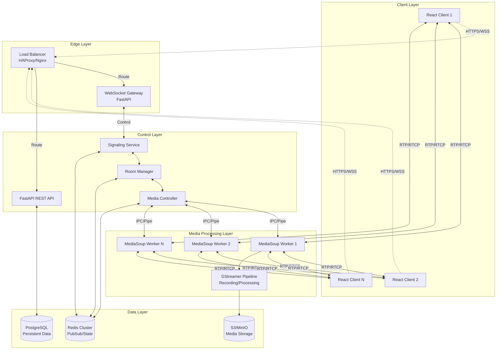
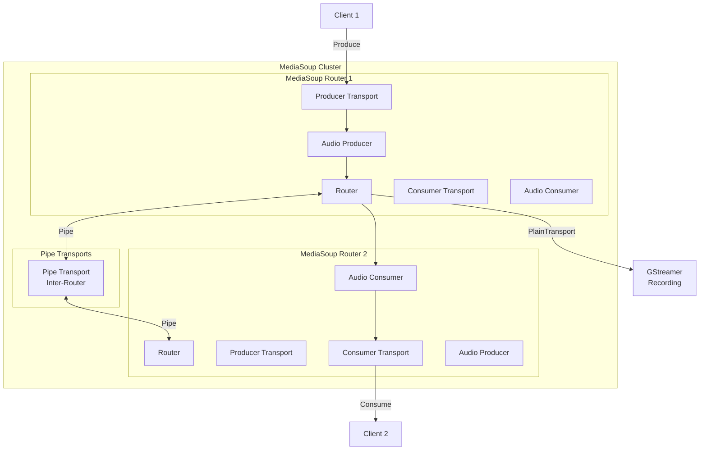
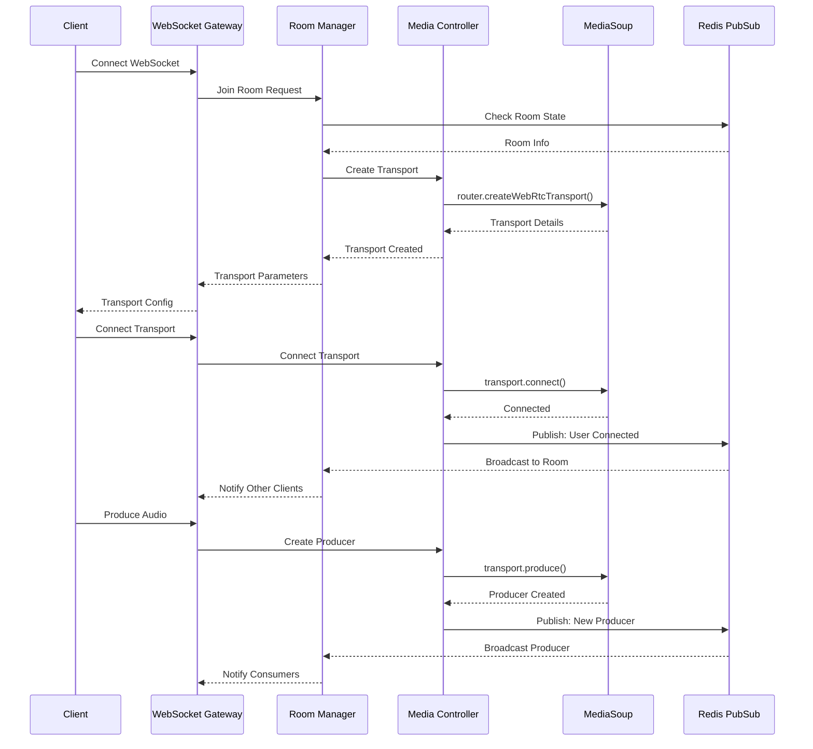
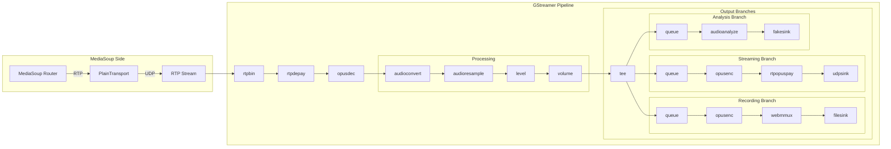
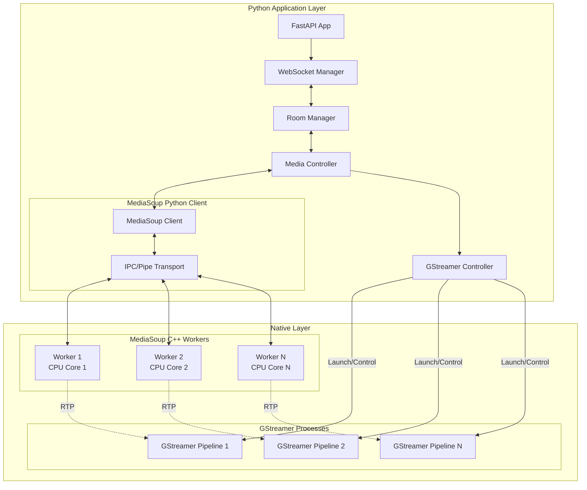
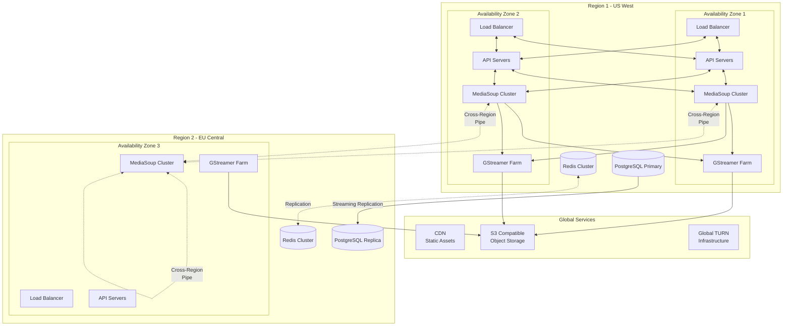
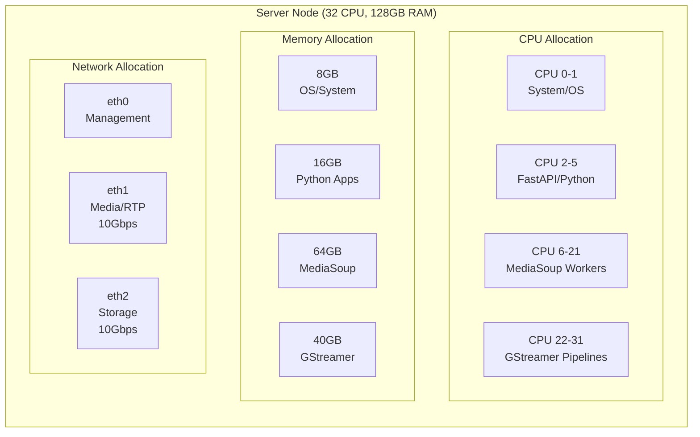
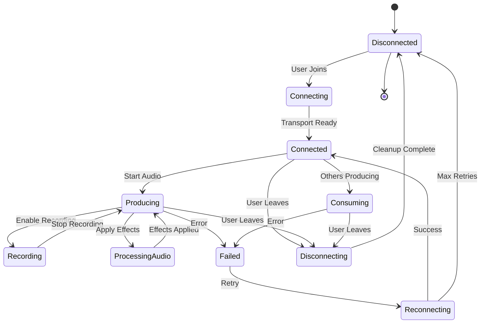
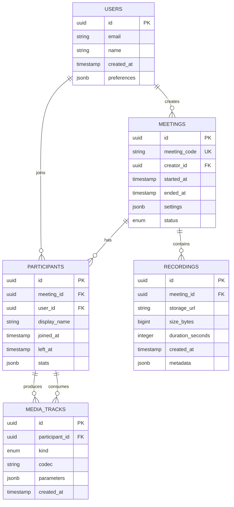
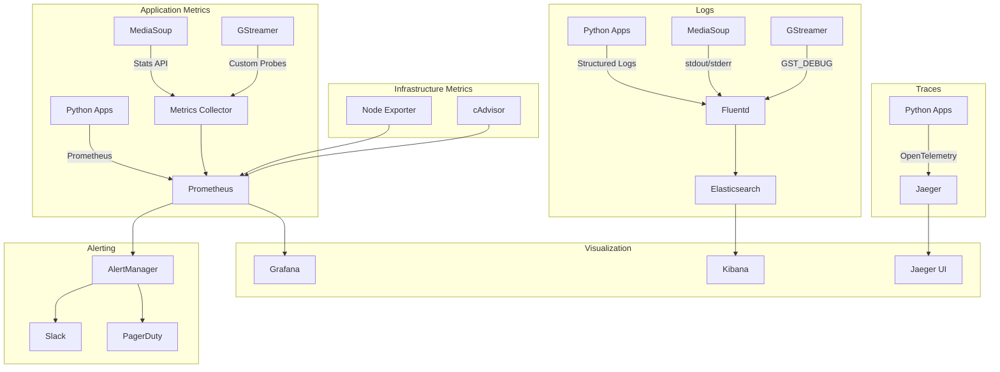

## WebRTC Architecture with MediaSoup and GStreamer

### Overall System Architecture

### MediaSoup Architecture Detail

### Signaling Flow Sequence

### GStreamer Integration Architecture

### Component Interaction Architecture

### Scaling and High Availability Architecture

### Resource Allocation Strategy

### Media Flow State Machine

### Database Schema Design

### Monitoring and Observability Architecture

This architecture leverages MediaSoup's excellent performance for WebRTC media routing and GStreamer's flexibility for media processing, recording, and analysis. The system is designed for horizontal scaling, high availability, and comprehensive observability.
